# Social Media Based Library App

This application is my thesis project. The starting point of the project is as follows;   ***I love reading books. After reading the book, I write summaries and notes. There is no app that can do this. That's why I keep all these notes in my [myLibrary](https://github.com/ufukcankurt/myLibrary) repo on github... Considering all this, I decided to turn it into an application.***

## Built With 🛠
- [***React.js***](https://reactjs.org/)
- [***Express.js***](https://expressjs.com/)
- [***Node.js***](https://nodejs.org/en/)
- [***REST API***](https://aws.amazon.com/tr/what-is/restful-api/)
- [***MongoDB***](https://www.mongodb.com/)
- [***Firebase***](https://firebase.google.com/)

***You can check out the other repos the app has below.***
- [***Server Client***](https://github.com/ufukcankurt/books-library-api)
- [***Admin Client***](https://github.com/ufukcankurt/books-library-admin) *soon
- [***Mobil Client***]() *soon

## Features ✨
- You can track your reading status.
- You can create your own personal shelves.
- After reading the books, you can write summaries and quotes. If you want, you can write in private notes that only you will see.
- You can reach all the news about the books in general.
- You can add friends
- You can share the post as you wish.
- You can share your thoughts with your friends and exchange different ideas and opinions.

## Screenshots 📸

- ***Home Page | You can see the books you are currently reading, share posts, see the posts shared by your friends and see the quotes in the today in history corner.***

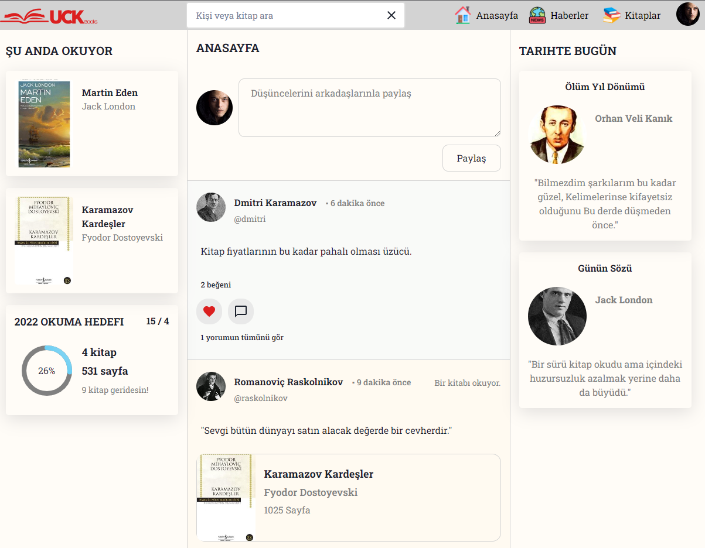

- ***Post Detail Page | You can like and comment on the post.***

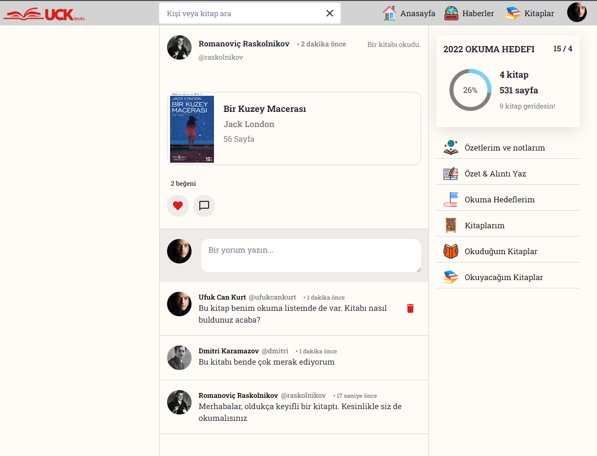

- ***Profil Page | You can see your own infos.***

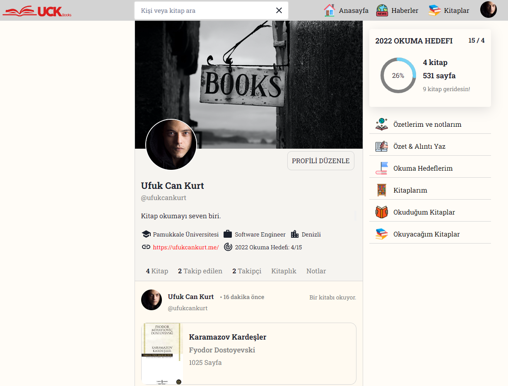

- ***Reading Target Page | You can set a reading goal for this year and track it.***

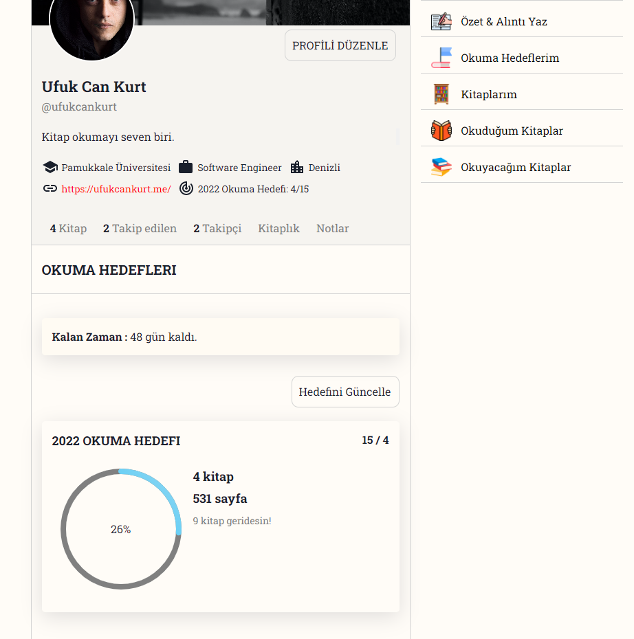

- ***Bookshelf Page | You can add and edit new shelves as you wish.***

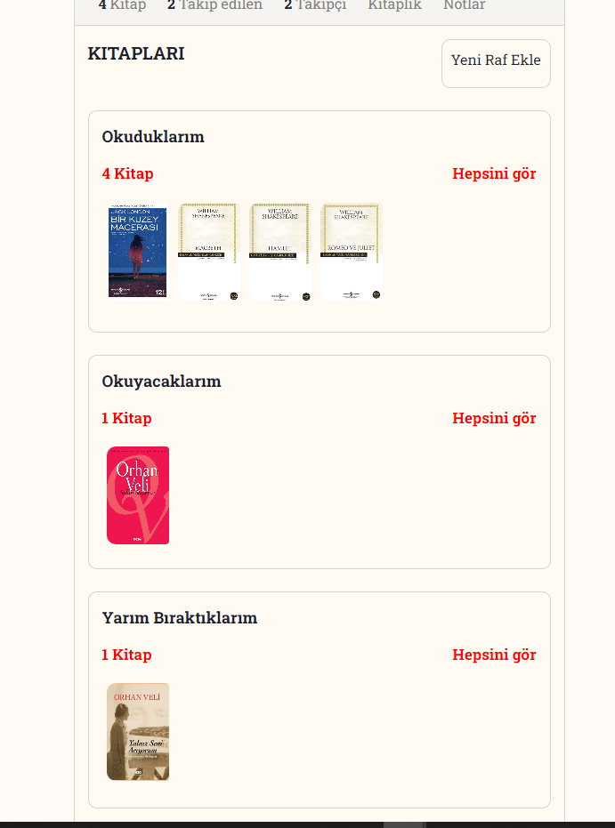

- ***Book Detail Page | You can see detailed information about the book and see the notes that other users have written for this book.***

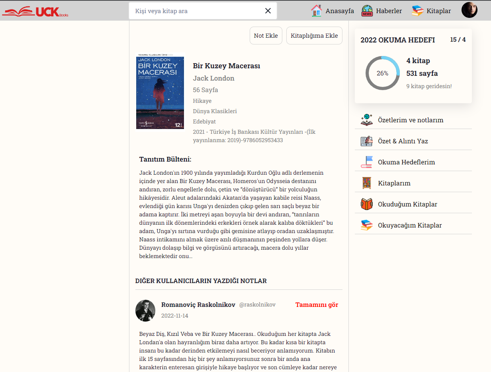

- ***Book Notes Page | After reading the book, you can write your own notes.***

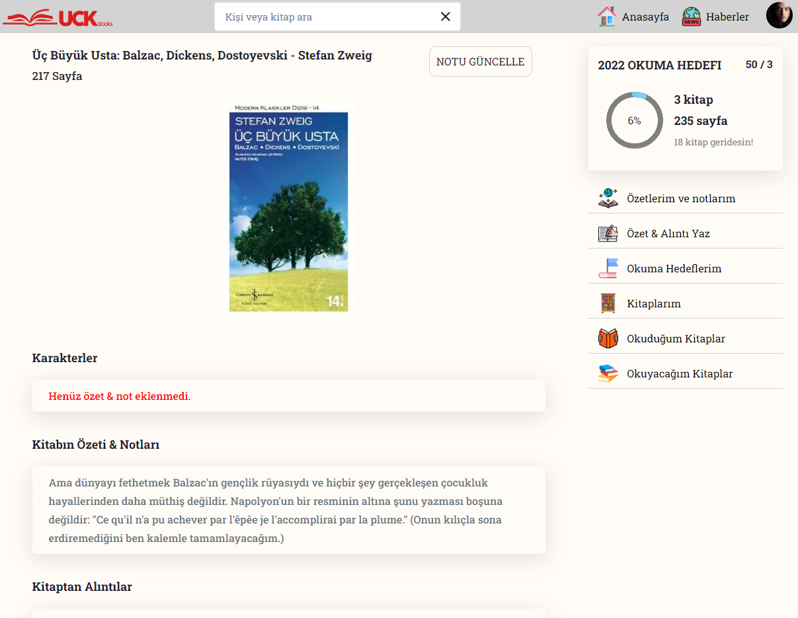

- ***Update Book Status Page | From here you can update your book status and add the books to your shelves.***

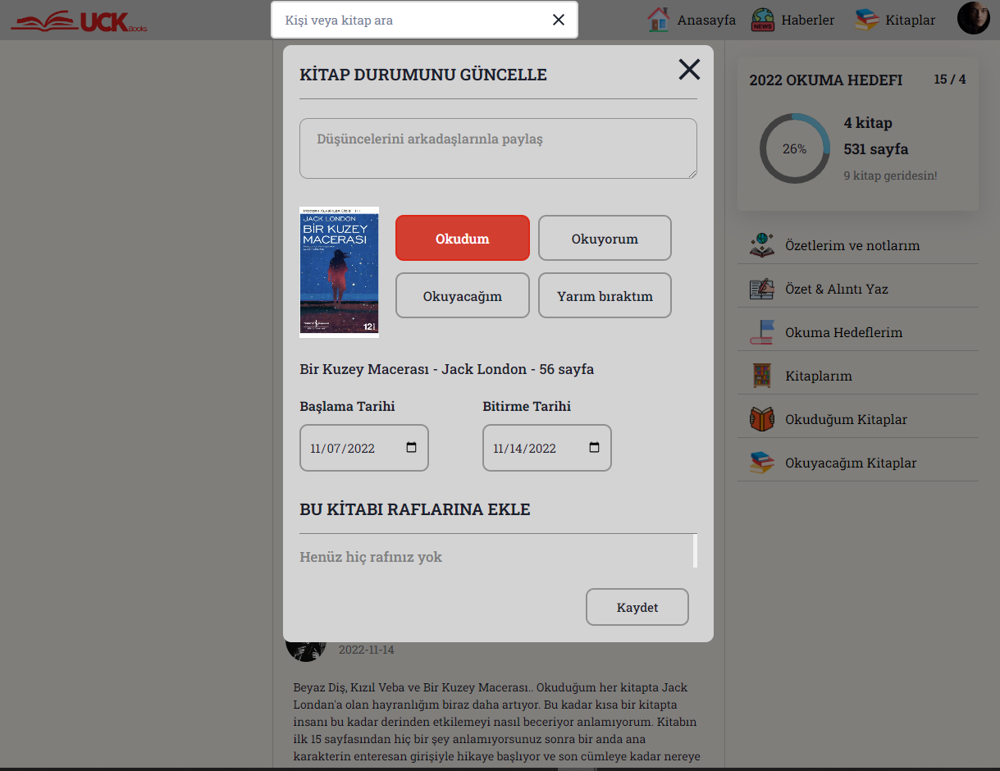

- ***News Page | Here you can find all the news about the books.***

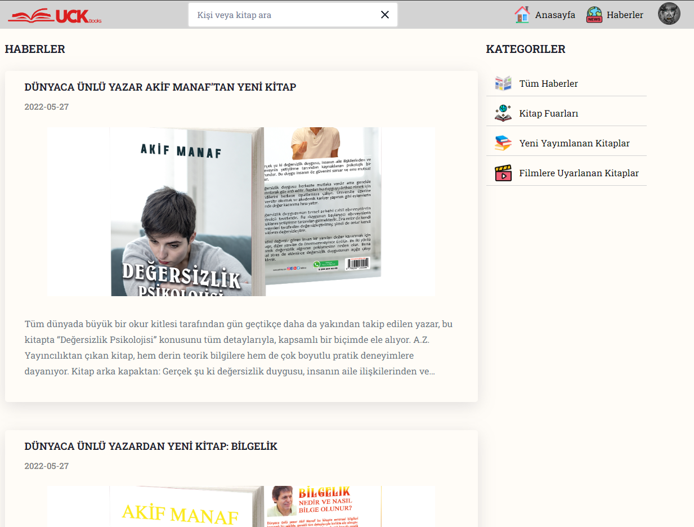

- ***Books Page | From here you can view all the books in the app.***

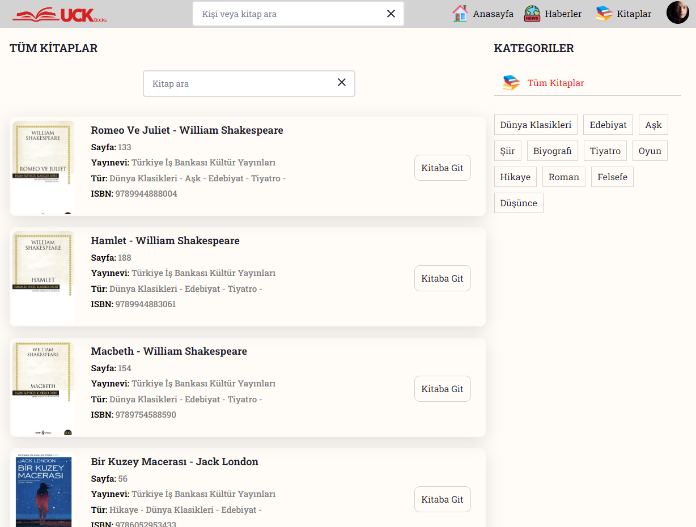

----

## The rest is for admins only.

- ***Admin Page | We can add new data from here as admin.***

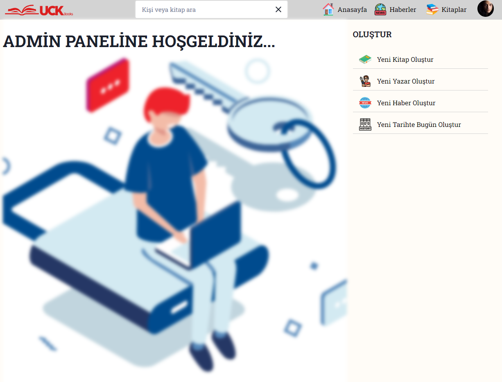

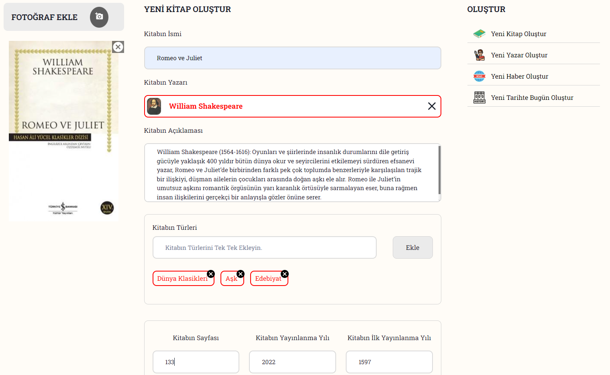

